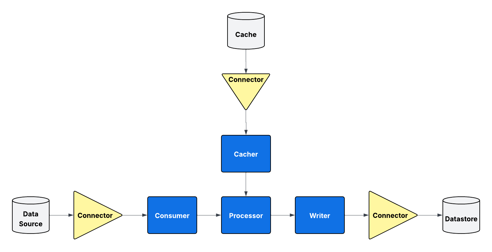

# MetrANOVA Pipeline

A data pipeline for processing and storing network measurement data.

## Architecture Overview

The MetrANOVA Pipeline implements a modular pipeline architecture that processes network telemetry data:



The system consists of several key components:

- **Consumers**: Read data from various sources (e.g. Kafka, Files, Redis, ClickHouse, etc)
- **Processors**: Transform and validate incoming data
- **Cachers**: Provide efficient lookup mechanisms for metadata during the processing phase
- **Writers**: Writes processed data to target database our other output channel
- **Connectors**: Provide standardized interfaces to underlying resources and can be used by any other component

A **pipeline** is a specific configuration of these components to access and process data between the various resources.

### Resource Types

The architecture supports three types of resources:

- **Data Sources**: Systems that provide streaming or batch data input (e.g. Files, Kafka topics)
- **Data Stores**: Persistent storage systems for long-term data retention and analytics (e.g. ClickHouse databases)
- **Caches**: High-performance, temporary storage for frequently accessed data and metadata lookups (e.g., Redis)

Each resource type is accessed through dedicated connectors that provide consistent interfaces and handle connection management, authentication, and error handling across the pipeline components. 

## Quick Start

### Prerequisites

1. Docker and Docker Compose
2. SSL certificates for Kafka authentication (if using Kafka connectors)
3. Access to ClickHouse (if using ClickHouse connectors)

### Setup

1. **Clone the repository**
   ```bash
   git clone https://github.com/MetrANOVA/pipeline.git
   cd pipeline
   ```

2. **Configure environment variables**
   ```bash
   cp -r conf.example/ conf/
   # Edit conf/envs/base.env with clickhouse and kafka credentials if applicable
   ```

3. **Set up SSL certificates** (for Kafka pipelines)
   ```bash
   # Place your Kafka SSL certificates:
   # - conf/certificates/kafka_ca.crt (CA certificate)
   # - conf/certificates/kafka_user.crt (User certificate) 
   # - conf/certificates/kafka_user.key (User private key)
   ```

4. **Set up local ClickHouse** (for development/testing)
   
   Start a local ClickHouse container:
   ```bash
   docker run -d --name clickhouse-server \
     -p 8123:8123 \
     -p 9000:9000 \
     --ulimit nofile=262144:262144 \
     -e CLICKHOUSE_PASSWORD=your_password_here \
     -v clickhouse-data:/var/lib/clickhouse \
     clickhouse/clickhouse-server:latest
   ```
   
   The ClickHouse server will be available at:
   - **HTTP interface**: `http://localhost:8123` (for web UI and HTTP queries)
   - **Native interface**: `localhost:9000` (for client connections)
   - **Default user**: `default`
   - **Password**: Set via `CLICKHOUSE_PASSWORD` environment variable
   
   Update your `conf/envs/base.env` with the local ClickHouse connection details:
   ```bash
   CLICKHOUSE_HOST=host.docker.internal  # Use host.docker.internal to access host from container
   CLICKHOUSE_PORT=9000
   CLICKHOUSE_USER=default
   CLICKHOUSE_PASSWORD=your_password_here
   CLICKHOUSE_DATABASE=default
   ```
   
   **Useful ClickHouse commands:**
   ```bash
   # Access ClickHouse CLI
   docker exec -it clickhouse-server clickhouse-client --password your_password_here
   
   # View logs
   docker logs clickhouse-server
   
   # Stop ClickHouse
   docker stop clickhouse-server
   
   # Start ClickHouse (after stopping)
   docker start clickhouse-server
   
   # Remove ClickHouse (keeps data volume)
   docker rm clickhouse-server
   
   # Remove ClickHouse and data
   docker rm clickhouse-server
   docker volume rm clickhouse-data
   ```
5. Decide which pipeline you want to run and find its conifguration file in in `conf/envs/`. For example to run the flow pipeline we will use `conf/envs/data_flow.env`. Copy this to `.env` and make any edits:
  ```bash
  cp conf/envs/data_flow.env .env #replace data_flow.env with chosen pipeline.  
  ```
  *NOTE: You can alternatively set the PIPELINE_ENV_FILE environment variable to the path of the chosen file instead of copying to .env. EXAMPLE: PIPELINE_ENV_FILE=conf/envs/data_flow.env* 

6. **Build and run the pipelines**
   ```bash
   docker compose up --build pipeline
   ```

## Running Pipelines in Development

You can run individual pipelines using `docker compose run` for testing, debugging, or one-time operations. You can also leverage the `PIPELINE_ENV_FILE` environment variable to easily switch between pipelines without changing .env. Example that runs the flow pipeline:
```
PIPELINE_ENV_FILE=conf/envs/data_flow.env docker compose run --rm --build pipeline
```

### Custom Pipeline Configurations

You can also override environment variables for custom pipeline configurations:

```bash
# Run with debug logging enabled
docker compose run -e DEBUG=true pipeline

# Run interface pipeline with specific processors only
docker compose run -e CLICKHOUSE_PROCESSORS=metranova.processors.clickhouse.interface.InterfaceTrafficProcessor pipeline

# Run with a different Kafka topic
docker compose run -e KAFKA_TOPIC=custom_topic pipeline
```

## Environment Variables
See [Environment Variables](docs/env_vars.md)

## Development

### Adding New Pipelines

1. Define a new YAML file in `pipelines/` with the desired consumers, cacher, processors and writers. Should be named in format `pipelines/<pipeline_name>.yml` where `<pipeline_name>` is name of pipeline.
2. Define a `conf/envs/<pipeline_name>.env` with a `PIPELINE_YAML=pipelines/<pipeline_name>.yml` environment variable and any other pipeline specific settings
3. Run the pipeline by running `cp conf/envs/<pipeline_name>.env .env` or by setting the PIPELINE_ENV_FILE environment variable as follows:
```bash
PIPELINE_ENV_FILE=conf/envs/<pipeline_name>.env docker compose run pipeline
```

### Adding New Processors

1. Create processor class inheriting from a base processor for the target output. Example: `BaseClickHouseProcessor`
2. Implement required methods
3. Add processor to appropriate file in `pipelines/` directory

## Performance Notes

- ClickHouse batch sizes can be tuned based on available memory and throughput requirements
- Multiple pipeline replicas can be run for horizontal scaling

## Monitoring

The system provides comprehensive logging at INFO and DEBUG levels. Key metrics to monitor:

- Batch insert rates and sizes
- Consumer lag on Kafka topics
- ClickHouse query performance
- Pipeline processing throughput

For production deployments, integrate with your monitoring stack to track these metrics. We plan to add OpenTelemetry support for enhanced observability and distributed tracing.