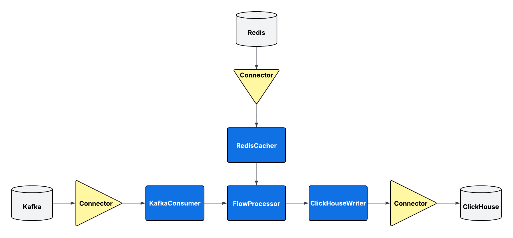
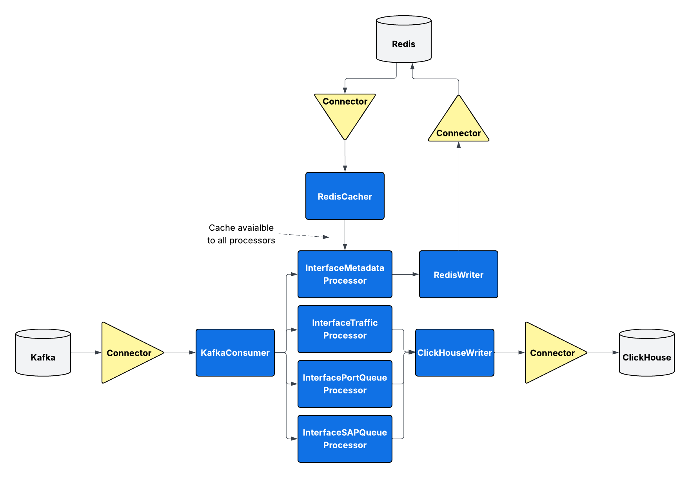
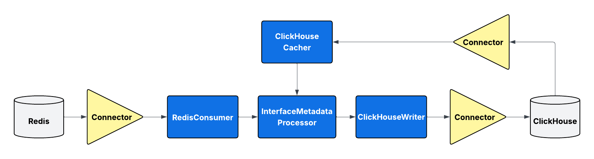

# MetrANOVA Pipeline

A data pipeline for processing and storing network measurement data.

## Architecture Overview

The MetrANOVA Pipeline implements a modular pipeline architecture that processes network telemetry data:


The system consists of several key components:

- **Consumers**: Read data from various sources (Kafka, Redis, ClickHouse)
- **Processors**: Transform and validate incoming data
- **Writers**: Store processed data in target databases
- **Cachers**: Provide efficient lookup mechanisms for metadata and metadata references
- **Connectors**: Provide standardized interfaces to underlying resources and can be used by any other component

A **pipeline** is a specific configuration of these components to access and process data between the various resources.

### Resource Types

The architecture supports three types of resources:

- **Data Sources**: Systems that provide streaming or batch data input (e.g., Kafka topics)
- **Data Stores**: Persistent storage systems for long-term data retention and analytics (e.g., ClickHouse databases)
- **Caches**: High-performance, temporary storage for frequently accessed data and metadata lookups (e.g., Redis)

Each resource type is accessed through dedicated connectors that provide consistent interfaces and handle connection management, authentication, and error handling across the pipeline components. 

## Quick Start

### Prerequisites

1. Docker and Docker Compose
2. SSL certificates for Kafka authentication (if using Kafka consumers)
3. Access to ClickHouse and Redis instances

### Setup

1. **Clone the repository**
   ```bash
   git clone <repository-url>
   cd metranova-clickhouse-writer
   ```

2. **Configure environment variables**
   ```bash
   cp env.example .env
   # Edit .env with your specific configuration
   ```

3. **Set up SSL certificates** (for Kafka pipelines)
   ```bash
   mkdir -p certificates/
   # Place your Kafka SSL certificates:
   # - certificates/kafka_ca.crt (CA certificate)
   # - certificates/kafka_user.crt (User certificate) 
   # - certificates/kafka_user.key (User private key)
   ```

4. **Build and run the pipelines**
   ```bash
   docker-compose up --build
   ```

## Running Individual Pipelines

You can run individual pipelines using `docker compose run` for testing, debugging, or one-time operations:

### Available Pipeline Services

Based on the docker-compose.yml configuration, you can run any of these pipeline services:

```bash
# Run the flow pipeline (processes network flow data)
docker compose run flow_pipeline

# Run the interface pipeline (processes interface statistics and queue data)
docker compose run interface_pipeline

# Run the metadata export pipeline (exports Redis metadata to ClickHouse)
docker compose run metadata_export_pipeline

# Run the metadata import pipeline (imports ClickHouse metadata to Redis)
docker compose run  metadata_import_pipeline
```

### Custom Pipeline Configurations

You can also override environment variables for custom pipeline configurations:

```bash
# Run with debug logging enabled
docker compose run -e DEBUG=true flow_pipeline

# Run interface pipeline with specific processors only
docker compose run -e CLICKHOUSE_PROCESSORS=metranova.processors.clickhouse.interface.InterfaceTrafficProcessor interface_pipeline

# Run with a different Kafka topic
docker compose run -e KAFKA_TOPIC=custom_topic flow_pipeline

# Run pipeline with JSON output for debugging
docker compose run -e PIPELINE_TYPE=json flow_pipeline
```

## Pipeline Types

### Flow Pipeline


Processes network flow data from Kafka and stores it in ClickHouse.

**Configuration:**
- `PIPELINE_TYPE=clickhouse`
- `CLICKHOUSE_PROCESSORS=metranova.processors.clickhouse.flow.FlowProcessor`
- `KAFKA_TOPIC=metranova_flow`

**Data processed:** Network flow records with source/destination information, BGP data, and traffic metrics.

### Interface Pipeline


Processes network interface statistics and queue data from Kafka, storing metrics in ClickHouse and metadata in Redis.

**Configuration:**
- `PIPELINE_TYPE=clickhouse`
- `CLICKHOUSE_PROCESSORS=metranova.processors.clickhouse.interface.InterfaceTrafficProcessor,metranova.processors.clickhouse.interface.InterfaceSAPQueueProcessor,metranova.processors.clickhouse.interface.InterfacePortQueueProcessor`
- `REDIS_HASH_PROCESSORS=metranova.processors.redis.interface.InterfaceMetadataProcessor`
- `KAFKA_TOPIC=metranova_interface`

**Data processed:** Interface traffic statistics, port queue metrics, SAP queue data, and interface metadata.

### Metadata Export Pipeline


Periodically exports metadata from Redis to ClickHouse for long-term storage and analytics. This pipeline runs on a scheduled interval to dump all metadata currently loaded in Redis into ClickHouse tables.

**Configuration:**
- `PIPELINE_TYPE=metadata_export`
- `CLICKHOUSE_PROCESSORS=metranova.processors.clickhouse.interface.InterfaceMetadataProcessor`

**Data processed:** Interface metadata from Redis hash tables to ClickHouse tables.

### Metadata Import Pipeline


Imports metadata from ClickHouse into Redis for fast lookup operations. This pipeline looks up ref fields which are used to point at other tables in ClickHouse and can be used for joins. This includes not only tables generated by external metadata collection systems, but also looks up the refs for interface metadata written by the interface pipeline itself.

**Configuration:**
- `PIPELINE_TYPE=metadata_import`

**Data processed:** Reference data from ClickHouse tables to Redis for caching and fast lookups during data processing.

## Environment Variables

### General Settings
| Variable | Default | Description |
|----------|---------|-------------|
| `DEBUG` | `false` | Enable debug logging |

### ClickHouse Configuration
| Variable | Default | Description |
|----------|---------|-------------|
| `CLICKHOUSE_HOST` | `localhost` | ClickHouse server hostname |
| `CLICKHOUSE_PORT` | `8123` | ClickHouse server port |
| `CLICKHOUSE_DATABASE` | `default` | ClickHouse database name |
| `CLICKHOUSE_USERNAME` | `default` | ClickHouse username |
| `CLICKHOUSE_PASSWORD` | `` | ClickHouse password |
| `CLICKHOUSE_SECURE` | `false` | Enable HTTPS connection |

### ClickHouse Table Names
| Variable | Default | Description |
|----------|---------|-------------|
| `CLICKHOUSE_FLOW_TABLE` | `flow_edge` | Flow data table name |
| `CLICKHOUSE_IF_TRAFFIC_TABLE` | `if_traffic` | Interface traffic table name |
| `CLICKHOUSE_IF_SAP_QUEUE_TABLE` | `if_sap_queue` | SAP queue table name |
| `CLICKHOUSE_IF_PORT_QUEUE_TABLE` | `if_port_queue` | Port queue table name |
| `CLICKHOUSE_RAW_KAFKA_TABLE` | `raw_kafka_messages` | Raw Kafka messages table |
| `CLICKHOUSE_IF_METADATA_TABLE` | `meta_if` | Interface metadata table |

### ClickHouse Processing Settings
| Variable | Default | Description |
|----------|---------|-------------|
| `CLICKHOUSE_BATCH_SIZE` | `1000` | Batch size for inserts |
| `CLICKHOUSE_BATCH_TIMEOUT` | `30.0` | Batch timeout in seconds |
| `CLICKHOUSE_FLUSH_INTERVAL` | `0.1` | Flush check interval |

### ClickHouse Consumer Settings
| Variable | Default | Description |
|----------|---------|-------------|
| `CLICKHOUSE_CONSUMER_UPDATE_INTERVAL` | `-1` | Update interval in seconds |
| `CLICKHOUSE_CONSUMER_TABLES` | `` | Comma-separated table list |
| `CLICKHOUSE_CACHER_TABLES` | `` | Tables for caching |
| `CLICKHOUSE_METADATA_FORCE_UPDATE` | `false` | Force metadata updates |

### Interface Queue Settings
| Variable | Default | Description |
|----------|---------|-------------|
| `CLICKHOUSE_IF_PORT_QUEUE_MIN` | `1` | Minimum port queue number |
| `CLICKHOUSE_IF_PORT_QUEUE_MAX` | `16` | Maximum port queue number |
| `CLICKHOUSE_IF_SAP_QUEUE_MIN` | `1` | Minimum SAP queue number |
| `CLICKHOUSE_IF_SAP_QUEUE_MAX` | `16` | Maximum SAP queue number |

### Kafka Configuration
| Variable | Default | Description |
|----------|---------|-------------|
| `KAFKA_BOOTSTRAP_SERVERS` | `localhost:9092` | Kafka broker addresses |
| `KAFKA_TOPIC` | `metranova_flow` | Kafka topic to consume |
| `KAFKA_CONSUMER_GROUP` | `ch-writer-group` | Consumer group ID |

### Kafka SSL Settings
| Variable | Default | Description |
|----------|---------|-------------|
| `KAFKA_SSL_CA_LOCATION` | `/app/certificates/ca-cert` | CA certificate path |
| `KAFKA_SSL_CERTIFICATE_LOCATION` | `/app/certificates/client-cert` | Client certificate path |
| `KAFKA_SSL_KEY_LOCATION` | `/app/certificates/client-key` | Client key path |
| `KAFKA_SSL_KEY_PASSWORD` | | Client key password |

### Kafka Consumer Tuning
| Variable | Default | Description |
|----------|---------|-------------|
| `KAFKA_AUTO_OFFSET_RESET` | `latest` | Offset reset policy |
| `KAFKA_ENABLE_AUTO_COMMIT` | `true` | Enable auto commit |
| `KAFKA_AUTO_COMMIT_INTERVAL_MS` | `5000` | Auto commit interval |
| `KAFKA_SESSION_TIMEOUT_MS` | `30000` | Session timeout |
| `KAFKA_HEARTBEAT_INTERVAL_MS` | `10000` | Heartbeat interval |
| `KAFKA_MAX_POLL_INTERVAL_MS` | `300000` | Max poll interval |
| `KAFKA_FETCH_MIN_BYTES` | `1` | Minimum fetch bytes |
| `KAFKA_FETCH_MAX_BYTES` | `52428800` | Maximum fetch bytes |
| `KAFKA_SSL_ENDPOINT_IDENTIFICATION_ALGORITHM` | `https` | SSL endpoint verification |

### Redis Configuration
| Variable | Default | Description |
|----------|---------|-------------|
| `REDIS_HOST` | `localhost` | Redis server hostname |
| `REDIS_PORT` | `6379` | Redis server port |
| `REDIS_DB` | `0` | Redis database number |
| `REDIS_PASSWORD` | | Redis password |

### Redis Consumer Settings
| Variable | Default | Description |
|----------|---------|-------------|
| `REDIS_CONSUMER_UPDATE_INTERVAL` | `-1` | Update interval in seconds |
| `REDIS_CONSUMER_TABLES` | `` | Comma-separated table list |

### Redis Interface Metadata
| Variable | Default | Description |
|----------|---------|-------------|
| `REDIS_IF_METADATA_TABLE` | `meta_if_cache` | Interface metadata cache table |
| `REDIS_IF_METADATA_EXPIRES` | `86400` | Cache expiration in seconds |

### Pipeline Configuration (Docker Compose)
These variables are typically set in `docker-compose.yml` rather than `.env`:

| Variable | Description |
|----------|-------------|
| `PIPELINE_TYPE` | Pipeline type: `clickhouse`, `metadata_import`, `metadata_export`, `json` |
| `CLICKHOUSE_PROCESSORS` | Comma-separated list of ClickHouse processor classes |
| `REDIS_PROCESSORS` | Comma-separated list of Redis processor classes |
| `REDIS_HASH_PROCESSORS` | Comma-separated list of Redis hash processor classes |

## Development

### Adding New Processors

1. Create processor class inheriting from `BaseClickHouseProcessor` or `BaseRedisProcessor`
2. Implement required methods: `match_message()`, `build_message()`
3. Add processor to appropriate environment variable in docker-compose.yml

## Performance Notes

- ClickHouse batch sizes can be tuned based on available memory and throughput requirements
- Multiple pipeline replicas can be run for horizontal scaling

## Monitoring

The system provides comprehensive logging at INFO and DEBUG levels. Key metrics to monitor:

- Batch insert rates and sizes
- Consumer lag on Kafka topics
- ClickHouse query performance
- Pipeline processing throughput

For production deployments, integrate with your monitoring stack to track these metrics. We plan to add OpenTelemetry support for enhanced observability and distributed tracing.